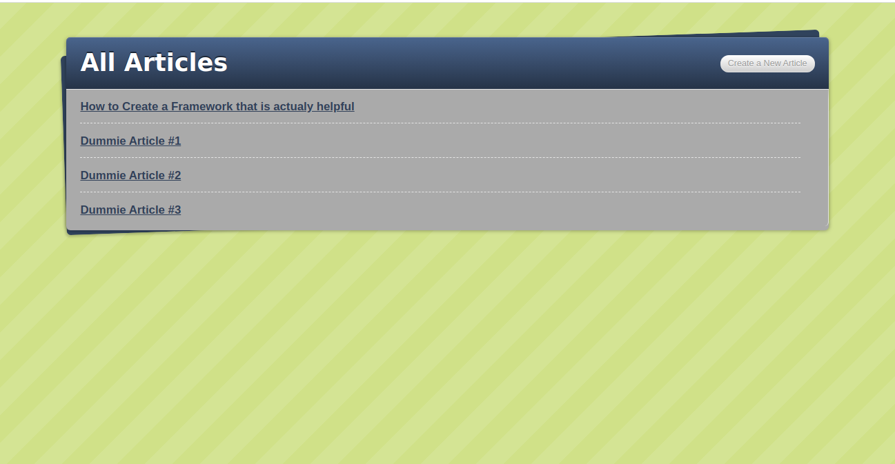
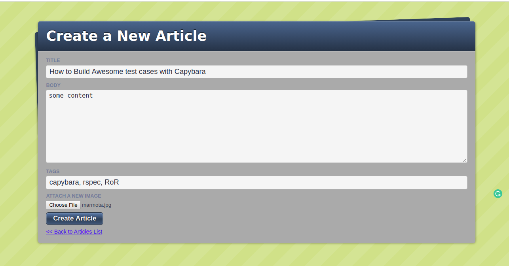
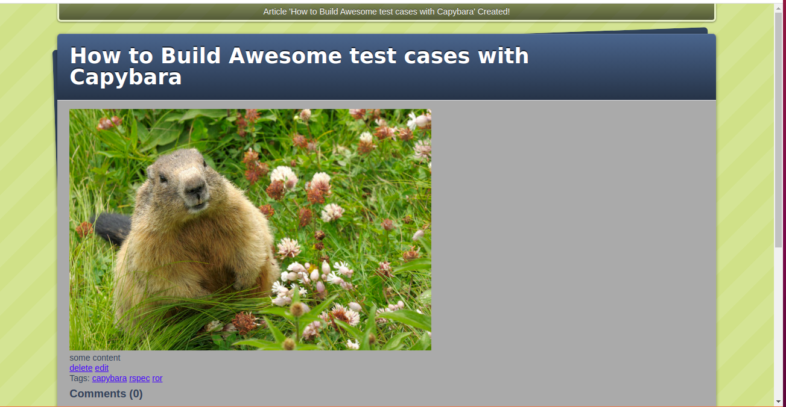
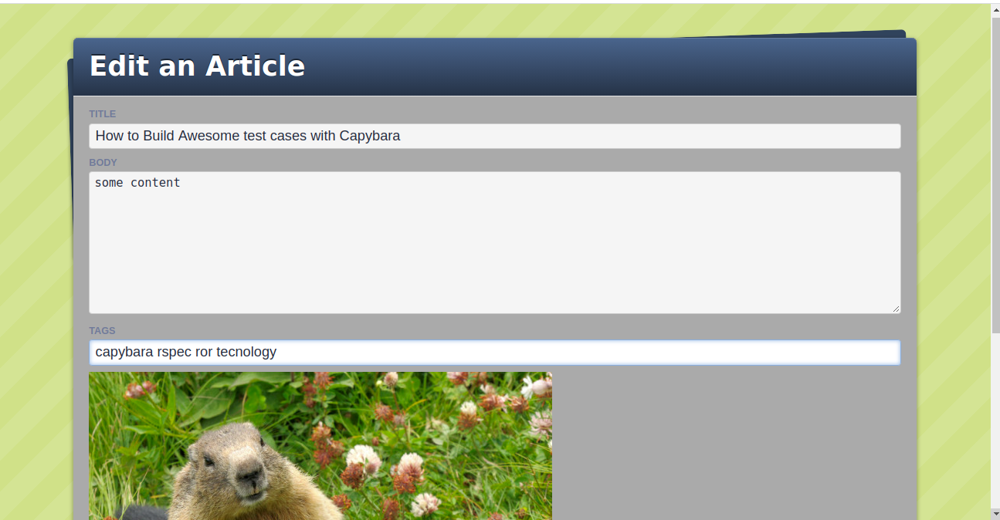
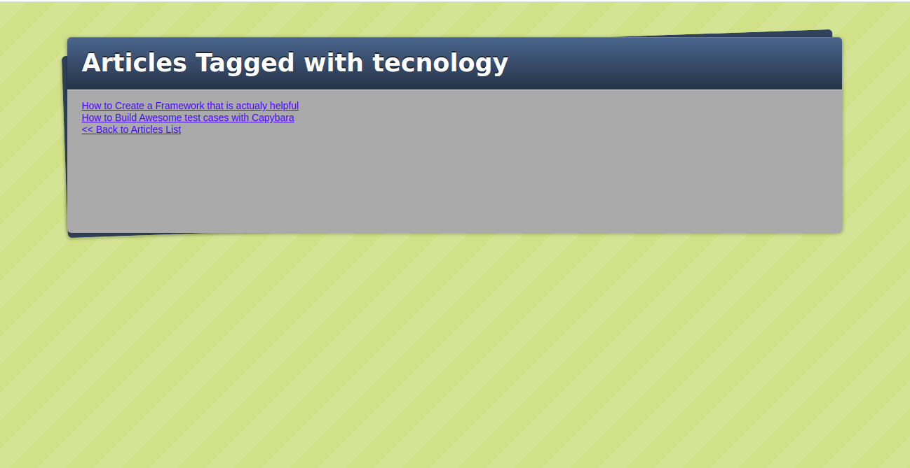
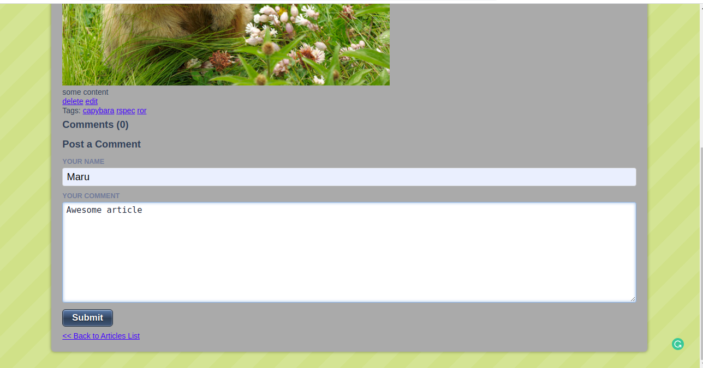
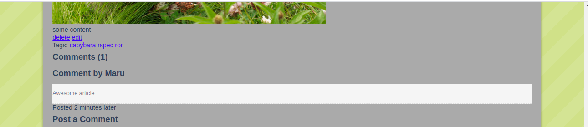

# Blogger-Rails

> This the Blogger 2 tutorial from jumpstartlab.
> The purpose of this project is to practice and learn the basics of Ruby on Rails. 



## Built With

- Ruby 2.6.5
- Rails 6.0.1
- Paperclip > 6
- VSCode

## Getting Started
To get a local copy up and running follow these simple example steps.

### Clone or Download
Donwload the repo with this [link](https://github.com/euqueme/Blogger-Rails/archive/master.zip) or clone it with the following command within a terminal:

```git clone https://github.com/euqueme/Blogger-Rails.git```

### Setup

cd to the project:

```cd Blogger-Rails```

Install gems with:

```bundle install```

Setup database with:

```rails db:migrate```

## Usage
Start server with:

```rails server```

Open http://localhost:3000/ in your browser.

### Articles New page
Tag New within Articles New page


### Articles Show page
Tag Show within Articles show page


### Articles Edit page
Tag Edit within Articles Edit page


### Tag Search
click on any tag within an Article Show page


### Comments New 
within Articles Show page


### Comments Show
within Articles Show page



## Live Demo

[Live Demo Link](https://maru-blogger2-jumpstarlab.herokuapp.com/)

## Automated Test

> there are no automated tests for this project yet

## Author

👤 **María Eugenia Quemé**

- Github: [@euqueme](https://github.com/euqueme)
- Linkedin: [María Eguenia Quemé Peña](https://www.linkedin.com/in/maria-queme/)

## 🤝 Contributing

Contributions, issues and feature requests are welcome!

Feel free to check the [issues page](https://github.com/euqueme/Blogger-Rails/issues).

## Show your support

Give a ⭐️ if you like this project!

## Acknowledgments

You can check the tutorial [here](http://tutorials.jumpstartlab.com/projects/blogger.html)

This assignment is part of the [Microverse Curriculum.](www.microverse.org)

## 📝 License

MIT

